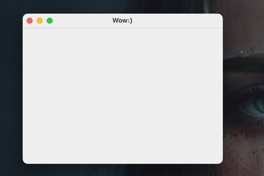
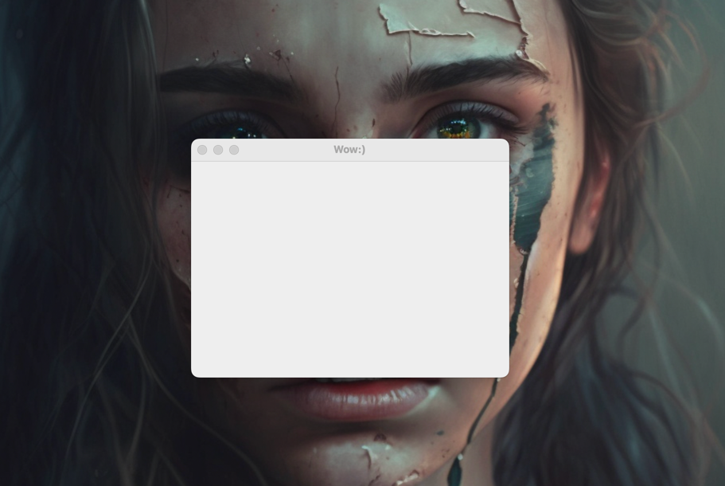
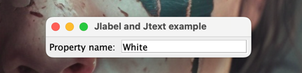
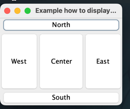
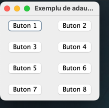
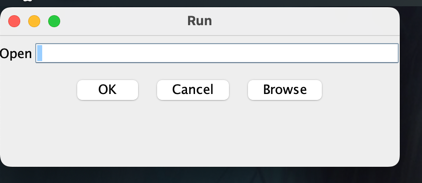

### Probleme de laborator

Observație! Se vor utiliza clasele Swing corespunzătoare celor AWT: JFrame pentru Frame, JButton pentru Button, JTextField pentru TextField etc.

#### Problema 1 (1 punct) 
Program pentru afişarea unei ferestre cu titlu folosind clasa JFrame. 
Funcţia main() creează un obiect JFrame, stabileşte dimensiunile şi cere afişarea acestuia. 
Veţi folosi metodele setSize(), respectiv setVisible(). Să se observe efectul unui clic pe butonul de închidere (X). 
Pentru terminarea aplicaţiei tastaţi CTRL-C. 
Adăugaţi apoi următoarea instrucţiune, unde jf este obiectul JFrame tocmai creat: jf.setDefaultCloseOperation( JFrame.EXIT_ON_CLOSE );
####    Result:

#### Problema 2 (1 punct) 
Pentru afişarea unei ferestre centrate pe mijlocul ecranului, se va folosi funcţia următoare (ca metodă statică, separată de clasa JFrame): public static void center (Window w) { Dimension ws = w.getSize();

`Dimension ss = Toolkit.getDefaultToolkit().getScreenSize(); int newX = ( ss.width - ws.width ) / 2;
`
`int newY = ( ss.height- ws.height ) / 2;`

`w.setLocation( newX, newY ); }
`
Să se adauge metoda de mai sus ca metodă a clasei anterioare.
####    Result:

#### Problema 3 (2 puncte) 
Program pentru afişarea unei etichete JLabel urmată de un câmp text JTextField nemodificabil (se va folosi metoda setEditable() cu parametrul false), pentru afişarea numelui şi valorii unei proprietăţi (de exemplu numele Color în etichetă şi valoarea White în campul text). Se va folosi aşezarea FlowLayout. Se vor adăuga apoi:

bordură la câmpul text (se va folosi setBorder( new EtchedBorder() ))
culoarea albă la câmpul text (se va folosi setBackground( Color.white ))
dimensiunea dorită la câmpul text (de exemplu setPreferredSize( new Dimension( 180, 20 ) ))
####    Result: 

#### Problema 4 (2 puncte) 
Program care adaugă unei ferestre JFrame (având dimensinile 240, respectiv 200) cinci butoane cu numele extrase din vectorul următor: String pos[]= { "East", "West", "North", "South", "Center" };
se va adăuga la această fereastră (într-un ciclu) fiecare buton folosind metoda add() cu doi parametri:
numele variabilei buton JButton
un şir care arată poziţia butonului în panou (acelaşi cu inscripţia butonului din vectorul pos)
Observaţie! Modul de aşezare implicit este BorderLayout.
se va elimina al doilea argument al metodei add() şi se va observa efectul
se va modifica modul de aşezare în fereastra principala la FlowLayout setLayout ( new FlowLayout() );
se va modifica modul de aşezare în fereastra principală la GridLayout, folosind succesiv constructor fără argumente sau cu două argumente întregi:
primul argument 0
al doilea argument numărul de coloane prin care se dispun componentele în panou: 0, 1, 2
####    Result:

#### Problema 5 (2 puncte) 
Program care foloseşte un vector de opt butoane JButton şi un vector de panouri JPanel. Se va adăuga fiecare buton unui panou separat şi apoi se va adauga fiecare panou ferestrei principale. Dispunerea în container-ul principal este GridLayout pe două coloane. Se va compara adăugarea directă a butoanelor la fereastră cu adăugarea prin panouri separate. Fereastra principală poate avea dimensiunile (200, 200). Pentru crearea de intervale între panouri se poate folosi metoda setBorder():
`pp[i].setBorder( new EmptyBorder( 1, 1, 1, 1 ) );
`sau
`pp[i].setBorder( BorderFactory.createEmptyBorder( 1, 1, 1, 1 ) );
`
####    Result:

#### Problema 6 (2 puncte) 
Program care adaugă ferestrei principale două panouri, unul sub altul:
un panou cu un câmp text JTextField şi o eticheta JLabel ce conţine şirul Open. Eticheta poate fi în stânga sau deasupra câmpului text. Câmpul text are lungime de 30 de caractere (se va folosi new JTextField( " ", 30 ))
un panou cu trei butoane în linie, notate OK, Cancel şi Browse.
Fereastra principală are dimensiunile `(400, 160)`. Faceţi modificările necesare pentru ca fereastra afişată să semene cât mai bine cu fereastra produsă de comanda Run din Windows (cu titlul Run). Modificaţi în programul anterior stilul de desenare (Look and Fell) pentru sistemul gazdă folosind metoda setLookAndFeel() astfel:

`try 
{ UIManager.setLookAndFeel(                     
UIManager.getSystemLookAndFeelClassName() );
} catch( Exception e ) { } `

#### Result : 
